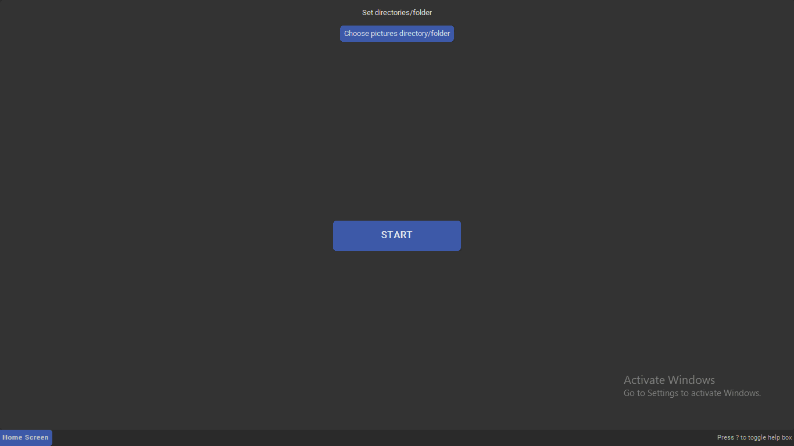

# VIM-inspired Photo Manager

**Keyboard base photo management software**

_"Make decisions with less actions: keeping or deleting an image"_

 

_Inspired by_

 
 

---

## Features

- Support for jpegs and raws being located in different directories

- Visually see the intended action for the image:
  - Actions:
    - Keep
    - Delete

- Inspecting an image:
  - Panning
  - Zooming

### Other notable features

- Utilizes caching:
  - Saves processing time on subsequent processing of the same image
  - Cache utilization is independent of file relocation

---

## Instructions to build the software from source

### Requirements

#### Python

> [!TIP]
>
> - Commands to install Python in Linux:
>   - `apt update && apt install -y python3 pip`
> - You can install the packages by excuting the following command on the "requirements.txt" file:
>   - `pip install -r requirements.txt`

- Version: `3.12`
- Python packages:
  - numpy
  - pillow
  - customtkinter
  - xxhash

### Steps

- Clone or download this repository:
- Run the software:
  - Run the command `python main`
